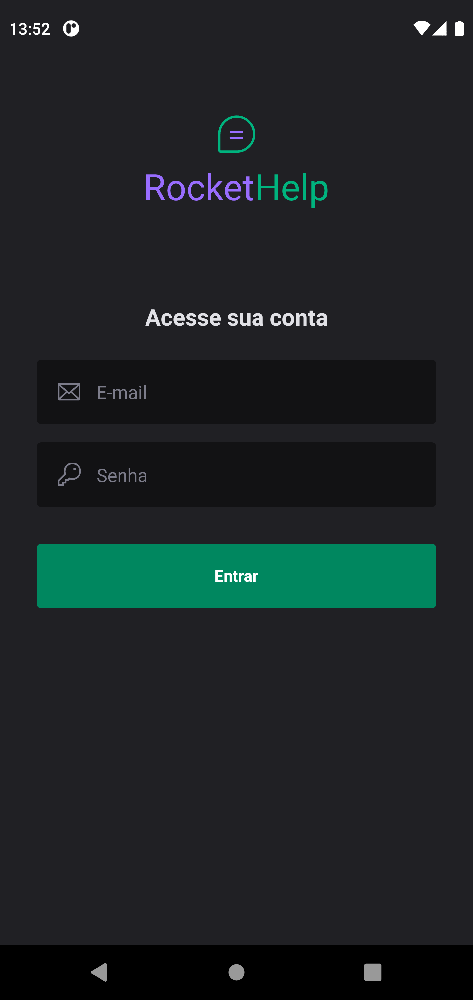
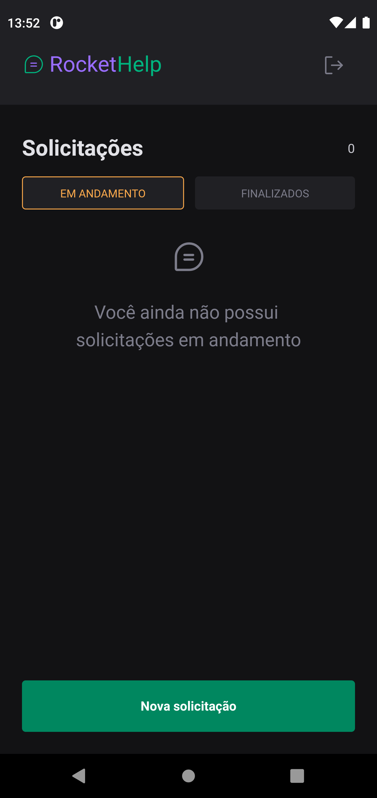
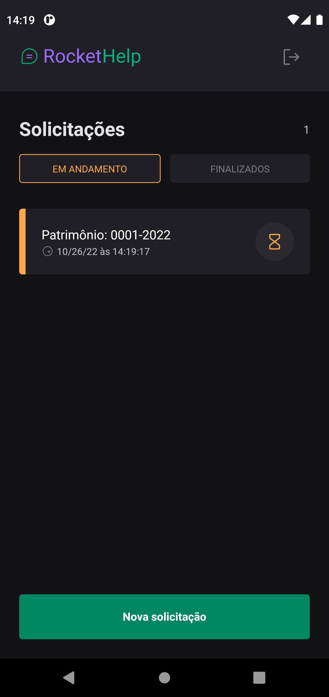
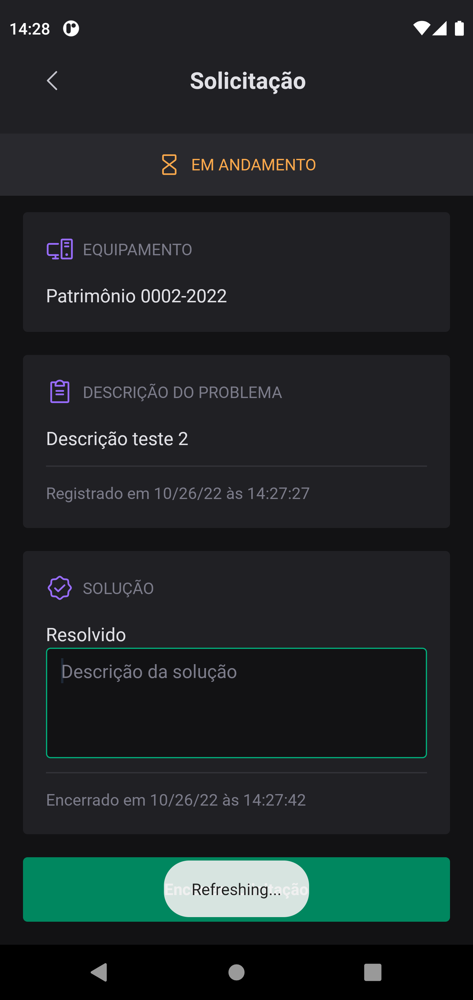
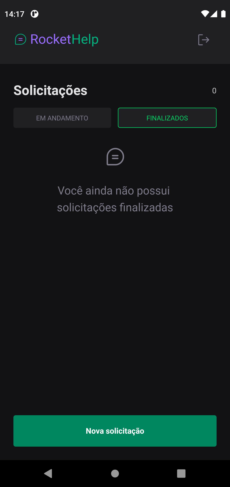
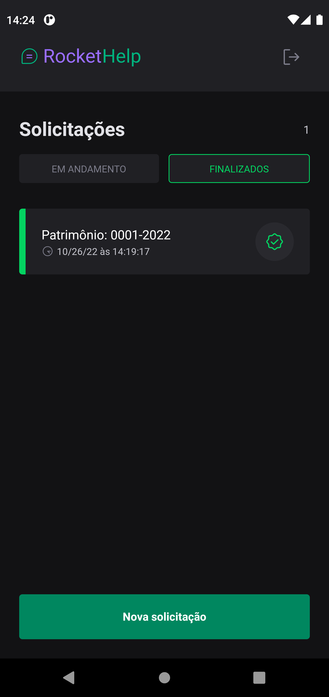
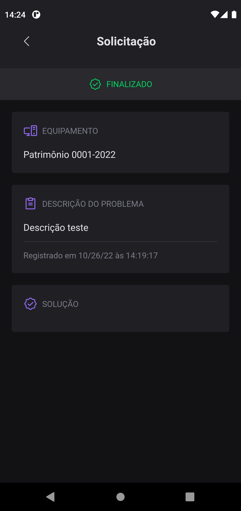
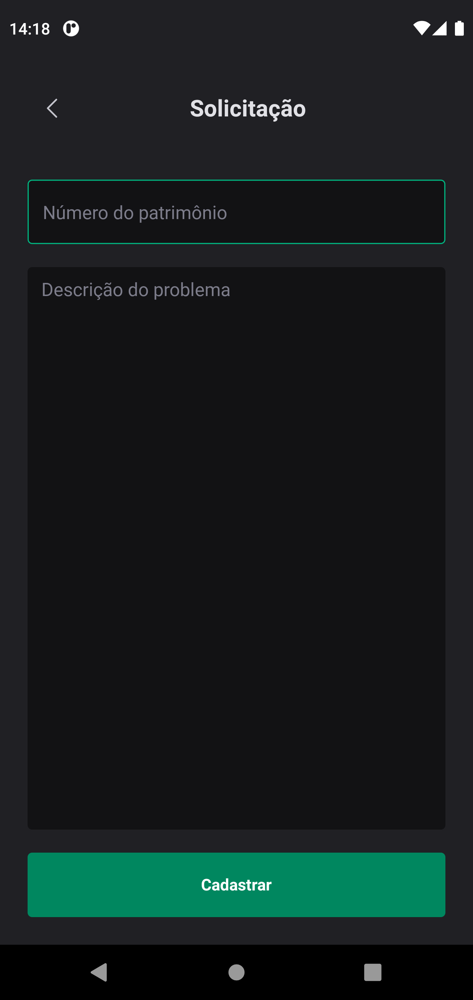

<p align="center">
  
  <br>
</p>
<h4 align="center">
  RocketHelp, aonde seus pedidos ganham vida!
</h4>

<br>

<p align="center">
  
  
  
  
</p>

<br>

<p align="center">
  <a href="#sobre">Sobre</a> •
  <a href="#rocketHelp">rocketHelp</a> •
  <a href="#instalação">Instalação</a> •
  <a href="#tecnologias">Tecnologias</a> •
  <a href="#autor">Autor</a>  
</p>

<br>

## Sobre

Aplicação desenvolvida durante o evento Ignite Lab 03 de React Native da RocketSeat.

## rocketHelp

O RocketHelp é uma aplicação móvel para realizar solicitações de atendimento para times de suporte.
Para logar na aplicação o usuário deve cadastrar um e-mail e senha para realizar o login dentro do app. O login é feito na tela abaixo utilizando os dados cadastrados:



Após realizar o login, o usuário é direcionado para a tela inicial da aplicação onde as solicitações já cadastradas serão exibidas. Dentro do app as solicitações podem possuir dois status: **Em andamento** e **Finalizadas**. E para alterar entra a lista de cada um dos status temos uma seleção no inicio da tela aonde o usuário pode alternar entre as listas por status e também visualizar quantas solicitações estão naquele status.

As tabelas abaixo mostram as duas listas citadas e o detalhe de uma solicitação para cada um dos status possíveis:

|                                                  Lista vazia                                                   |                                           Lista com item                                           |                                         Detalhe da solicitação                                         |
| :------------------------------------------------------------------------------------------------------------: | :------------------------------------------------------------------------------------------------: | :----------------------------------------------------------------------------------------------------: |
|  |  |  |

|                                                   Lista vazia                                                   |                                           Lista com item                                            |                                         Detalhe da solicitação                                         |
| :-------------------------------------------------------------------------------------------------------------: | :-------------------------------------------------------------------------------------------------: | :----------------------------------------------------------------------------------------------------: |
|  |  |  |

Podemos perceber que ao clicar em uma solicitação **Em andamento**, teremos um campo de texto para adicionar a solução do caso. Ao preencher esse campo e clicar no botão presente no final da tela, iremos adicionar essa solução na descrição do chamado e finaliza-lo. A descrição será exibida em um card dentro dos detalhes de uma solicitação já finalizada, como ilustrado na terceira imagem da segunda tabela.

No final da tela principal temos um botão para cadastrar uma nova solicitação, conforme exemplo abaixo, basta clicar sobre ele e informar os dados solicitados no formulário para que a solicitação seja cadastrada e fique na fila até que seja solucionada:



Basicamente esse é o fluxo da aplicação, tendo como funcionalidade o cadastro, listagem e tratamento de solicitações numa especie de help desk centralizada em um aplicativo móvel.

Abaixo deixo um GIF aonde navegamos por todas as telas do aplicativo afim de exemplificar o fluxo completo:


## Instalação

Antes de começar, você vai precisar ter instalado em sua máquina as seguintes ferramentas:
[Git](https://git-scm.com), [Node.js](https://nodejs.org/en/).
Além disto é bom ter um editor para trabalhar com o código como [VSCode](https://code.visualstudio.com/).

### 📱 Rodando o App

```bash
# Clone este repositório
$ git clone git@github.com:MrRioja/rocketHelp.git

# Acesse a pasta do projeto no terminal/cmd
$ cd rocketHelp

# Instale as dependências
$ npm install
# Caso prefira usar o Yarn execute o comando abaixo
$ yarn

# Execute a aplicação
$ expo start

# Será aberto no terminal o menu do Expo onde poderá scanear o QR Code para executar o app diretamente no seu celular ou as opções de executar no emulador android ou iOS
```

## Tecnologias


<br><br><br><br>

## Autor

<div align="center">

<h1>Luiz Rioja</h1>
<strong>Backend Developer</strong>
<br/>
<br/>

<a href="https://linkedin.com/in/luizrioja" target="_blank">

</a>

<a href="https://github.com/mrrioja" target="_blank">

</a>

<a href="mailto:lulyrioja@gmail.com?subject=Fala%20Dev" target="_blank">

</a>

<a href="https://api.whatsapp.com/send?phone=5511933572652" target="_blank">

</a>

<a href="https://join.skype.com/invite/tvBbOq03j5Uu" target="_blank">

</a>

<br/>
<br/>
</div>
